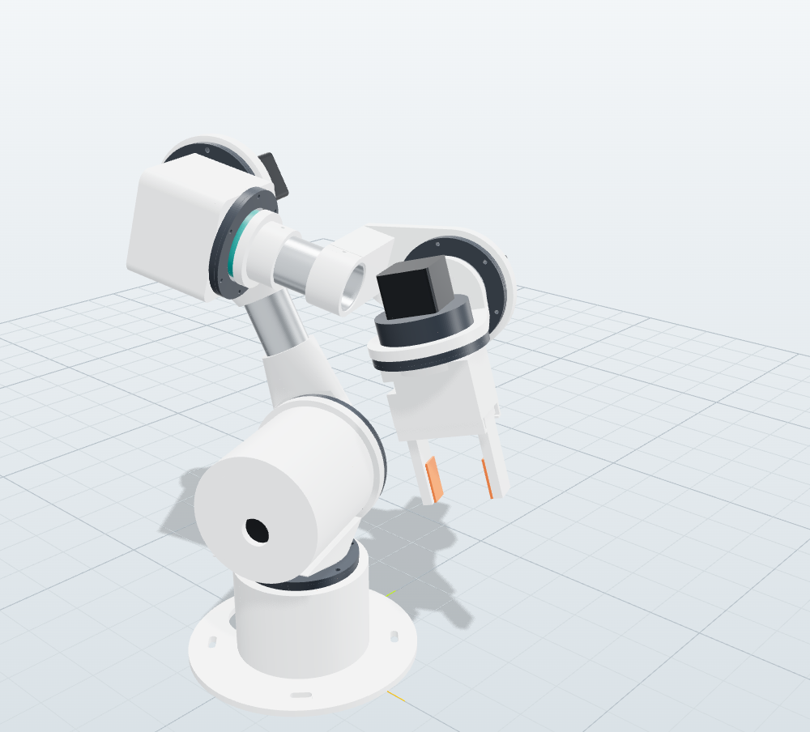
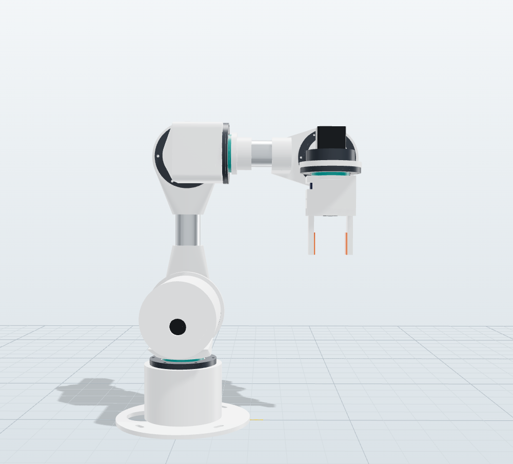
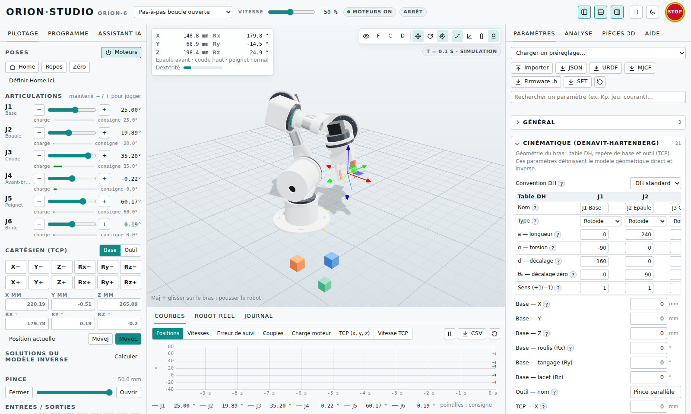
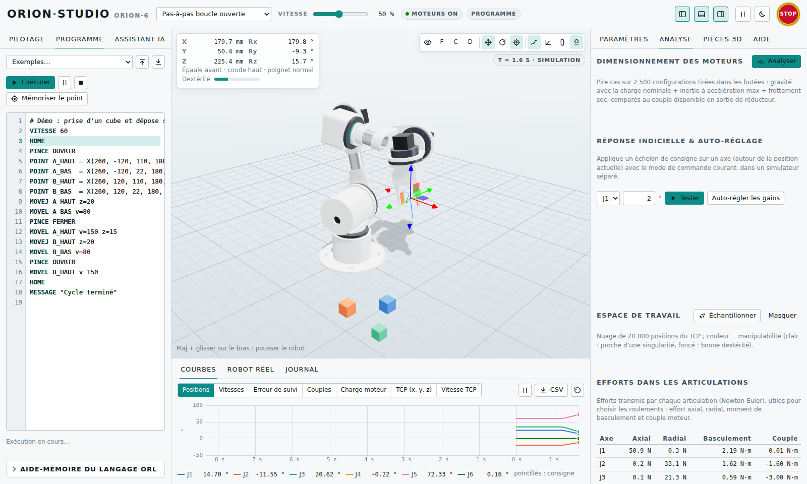
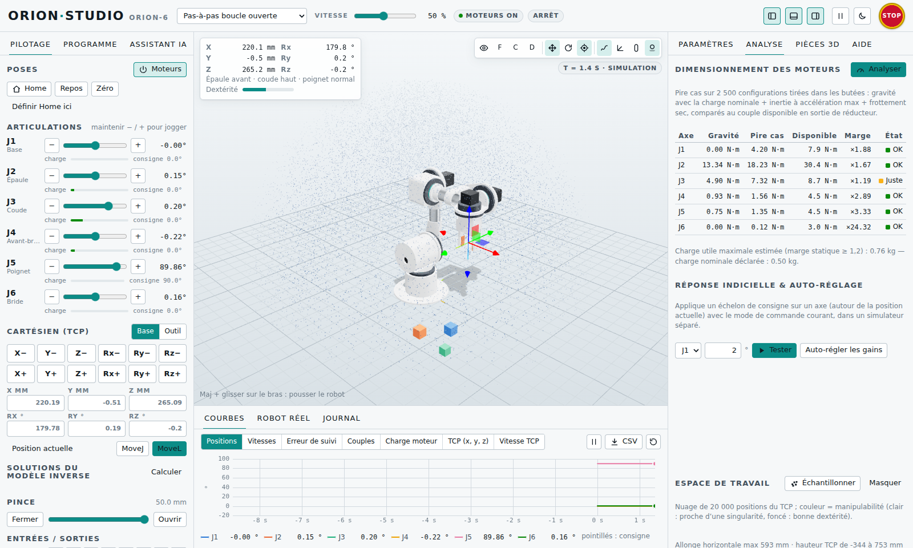
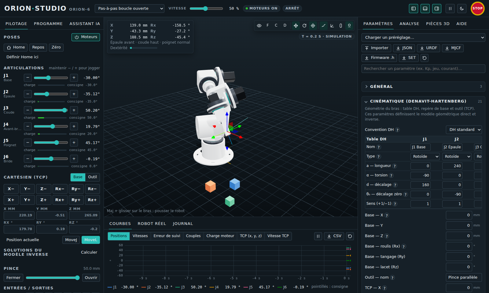

# ORION-6 — bras robotique 6 axes imprimé en 3D, avec son logiciel ORION Studio

<p align="center">
  
  
</p>

**ORION-6** est un bras robotique 6 axes à imprimer en 3D, pensé comme un bras « de laboratoire ». Le dépôt contient tout
le nécessaire :

- **ORION Studio**, un logiciel de simulation et de pilotage (navigateur, hors ligne) : vue 3D, pilotage articulaire et
  cartésien, programmes, assistant en langage naturel, analyse et courbes. **Tous les paramètres** du robot y sont réglables
  en direct : géométrie, masses, moteurs, réducteurs, gains PID et **mode MIT**, trajectoires, sécurité, brochage.
- La **CAO paramétrique** et les **37 fichiers STL** prêts à imprimer. Les réducteurs cycloïdaux sont imprimés, la pince
  est à crémaillère. Le dépôt fournit aussi la nomenclature chiffrée et des contrôles automatiques : interférences,
  débattements, taille du plateau.
- Deux **firmwares Teensy 4.1** testés :
  - le contrôleur **pas-à-pas** de la version MAKER ;
  - le **pont CAN « mode MIT »** de la version PRO, pour moteurs brushless QDD de type Damiao DM4340/DM4310.
- La **documentation en français** : théorie, réglages, impression, câblage, assemblage, calibration, protocole et
  dépannage.

> ⚠️ **Prototype non validé physiquement.** La conception a été vérifiée par calcul et simulation : cinématique, dynamique,
> dimensionnement, engrènement des cycloïdes, interférences CAO et tests du firmware sur PC. Aucun exemplaire n’a encore été
> imprimé ni assemblé. Commencez par le **test de tolérances** (`hardware/stl/tolerance-test.stl`) et un module réducteur
> seul. Un bras motorisé peut blesser : prévoyez un **arrêt d’urgence qui coupe la puissance**, voir
> [docs/09-electronique.md](docs/09-electronique.md).

## Aperçu d’ORION Studio



| Programme + courbes | Analyse (dimensionnement, espace de travail) | Thème sombre |
|---|---|---|
|  |  |  |

## Démarrage rapide

**Option 1 : sans rien installer.** Ouvrez `dist/ORION-Studio.html` dans Chrome, Edge ou Firefox. Ce fichier unique
fonctionne hors ligne ; il est produit par `npm run build:app`.

**Option 2 : depuis les sources.** Il faut Node.js ≥ 20.

```bash
npm install
npm start            # serveur local → http://localhost:8080/studio/
```

Ensuite, dans le logiciel :

1. Onglet **Programme** : chargez l’exemple *Prise et dépose*, puis **Exécuter**.
2. Onglet **Pilotage** : maintenez `−`/`+` pour bouger un axe. Vous pouvez aussi faire glisser le gizmo dans la vue 3D.
3. Onglet **Assistant IA** : tapez par exemple « monte de 5 cm puis ouvre la pince ».
4. Onglet **Paramètres** : modifiez n’importe quel réglage (par exemple *Kp*, *jeu*, *courant*). Le champ de recherche
   filtre la liste.

Pour piloter le **robot réel**, flashez la Teensy avec `firmware/bin/orion_fw-teensy41.hex`. Ouvrez ensuite l’onglet
**Robot réel** (Chrome/Edge sur ordinateur) et suivez [docs/11-firmware-protocole.md](docs/11-firmware-protocole.md).

## Caractéristiques (ORION-6 MAKER)

| | |
|---|---|
| Axes | 6 rotoïdes, poignet sphérique (modèle inverse analytique, 8 solutions) |
| Portée | 593 mm (horizontale, au point outil) ; 460 mm au centre du poignet |
| Hauteur de l’épaule | 160 mm ; point outil de −344 à +753 mm |
| Charge | 0,5 kg nominale ; environ 0,76 kg au maximum statique (marge 1,2) |
| Masse | ≈ 5,2 kg de parties mobiles (moteurs compris) + socle |
| Actionneurs | NEMA17/NEMA23 pas-à-pas + réducteurs **cycloïdaux imprimés** 20:1 à 30:1 |
| Vitesses max | 120 · 90 · 110 · 170 · 170 · 200 °/s (J1 → J6) |
| Commande | Teensy 4.1, drivers DM542T (ou TMC), génération de pas à 100 kHz, capteurs à effet Hall |
| Pince | parallèle à crémaillère, course 50 mm, servo MG996R, patins TPU |
| Impression | 37 STL, 58 pièces, ≈ 2,2 kg de PETG, plateau 220 × 220 × 250 mm |
| Coût matériel | ≈ 581 € ([nomenclature](docs/08-nomenclature.md)) |

La variante **ORION-6 PRO** remplace les pas-à-pas par des moteurs QDD **DM4340** (J1–J3) et **DM4310** (J4–J6). Elle est
commandée en **mode MIT** sur bus CAN : τ = Kp·(p* − p) + Kd·(v* − v) + τff, avec compensation de gravité, dans l’esprit
des bras de recherche YAM. Elle est complète côté simulation, réglage et firmware. Les brides d’adaptation imprimées pour
ces moteurs restent à dessiner.

## Organisation du dépôt

```
studio/            ORION Studio (HTML/JS, sans framework) — ouvrir studio/index.html via npm start
  core/            calculs : cinématique, dynamique, actionneurs, commande, trajectoires, simulateur,
                   langage ORL, assistant, protocoles, exports URDF/MJCF/firmware, schéma des paramètres
  ui/              interface : vue 3D (three.js), panneaux, courbes, liaison série (Web Serial)
  cad/             CAO paramétrique (manifold-3d) : réducteurs cycloïdaux, structure, pince
hardware/          STL imprimables, nomenclature (bom.csv), métadonnées des pièces (parts.json)
firmware/
  orion_fw/        firmware du contrôleur pas-à-pas (Teensy 4.1)
  mit_bridge/      firmware du pont USB ↔ CAN mode MIT (Teensy 4.1)
  test/            tests natifs sur PC (faux matériel, moteurs simulés)
  bin/             fichiers .hex prêts à flasher
docs/              documentation (français)
tools/             génération CAO/STL, documentation, configuration firmware, compilation
tests/             tests automatiques du cœur de calcul (node --test)
```

## Documentation

| | |
|---|---|
| [1. Présentation et choix de conception](docs/01-presentation.md) | le robot, les deux variantes, pourquoi des cycloïdes imprimées et le mode MIT |
| [2. Guide d’ORION Studio](docs/02-orion-studio.md) | interface, pilotage, programmes ORL, assistant, analyse, exports |
| [3. Référence de tous les paramètres](docs/03-parametres.md) | 179 paramètres, unités, plages, valeurs par défaut (généré) |
| [4. Cinématique](docs/04-cinematique.md) | table DH, modèles direct et inverse, singularités, espace de travail |
| [5. Dynamique et actionneurs](docs/05-dynamique.md) | Newton-Euler, frottements, articulation flexible, perte de pas |
| [6. Commande et réglage](docs/06-commande-et-reglage.md) | PID, **mode MIT**, couple calculé, impédance, trajectoires, méthode de réglage |
| [7. Impression 3D](docs/07-impression-3d.md) | réglages, orientation, liste des pièces (généré) |
| [8. Nomenclature](docs/08-nomenclature.md) | achats chiffrés (généré) |
| [9. Électronique et câblage](docs/09-electronique.md) | Teensy, drivers, alimentation, arrêt d’urgence, capteurs, bus CAN |
| [10. Assemblage](docs/10-assemblage.md) | réducteurs, structure, pince, passage des câbles |
| [11. Firmware et protocole](docs/11-firmware-protocole.md) | compilation, flashage, commandes série, flux temps réel, pont MIT |
| [12. Calibration et mise en service](docs/12-calibration.md) | sens, pas/°, prise d’origine, zéros, compensation de gravité |
| [13. Dépannage](docs/13-depannage.md) | symptômes → causes → remèdes |
| [14. Sources et inspirations](docs/14-sources.md) | références techniques et projets qui ont inspiré ORION-6 |

## Commandes utiles

| Commande | Rôle |
|---|---|
| `npm start` | lance ORION Studio en local (http://localhost:8080/studio/) |
| `npm test` | tests du cœur de calcul (cinématique, dynamique, programmes, exports, CAO) |
| `npm run test:firmware` | tests natifs des deux firmwares (g++/clang++, sans carte) |
| `npm run build:cad` | régénère la CAO : STL, nomenclature, masses et inerties, capsules de collision |
| `npm run build:docs` | régénère les pages de documentation générées (paramètres, pièces, nomenclature) |
| `npm run build:firmware-config` | régénère les `orion_config.h` à partir des préréglages |
| `npm run build:firmware` | compile les deux firmwares pour Teensy 4.1 (`firmware/bin/*.hex`) |
| `npm run build:app` | produit `dist/ORION-Studio.html`, un fichier unique hors ligne |

## Inspirations

ORION-6 s’inspire des bras de recherche **à moteurs brushless pilotés en mode MIT avec compensation de gravité**. Ce sont
les bras YAM d’i2rt, utilisés pour la démonstration robotique de **GPT-6 Astra** (OpenAI). Il s’inspire aussi des
nombreux bras imprimés présentés sur YouTube : AR4, Moveo, Thor, Dummy, SO-100/LeRobot. La chaîne **Defend Intelligence**
en montre un dans sa vidéo « Création bras Robot qui apprend ». Détails et liens :
[docs/14-sources.md](docs/14-sources.md).

## Licence

Aucune licence n’est encore choisie pour le code et les fichiers de ce dépôt. C’est à l’auteur du dépôt d’en décider (par
exemple MIT pour le logiciel et CERN-OHL-P pour le matériel). Les bibliothèques incluses conservent leur propre licence :
three.js (MIT) et manifold-3d (Apache-2.0), voir `studio/vendor/*/LICENSE`.
