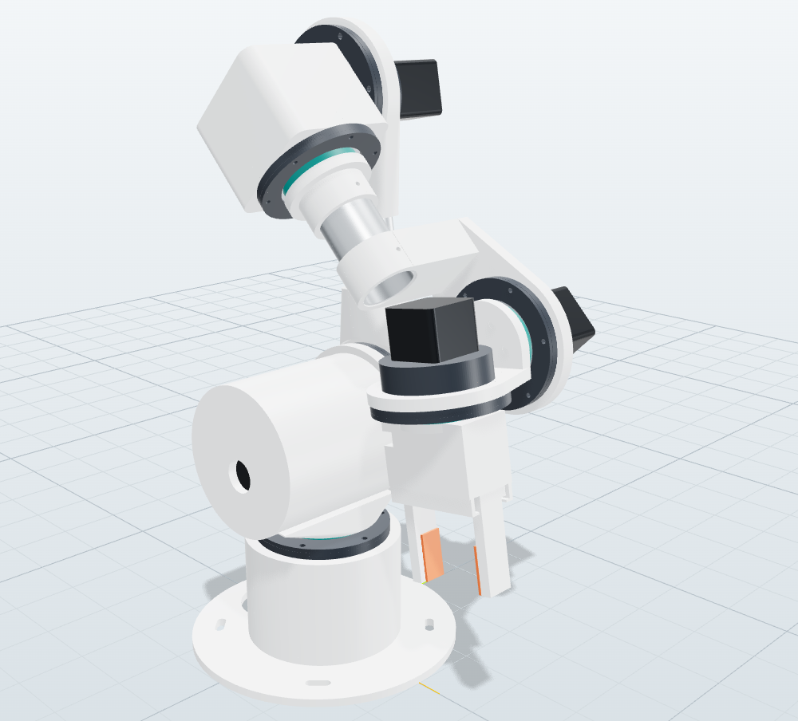

# 1. Présentation et choix de conception

## Le robot en bref

ORION-6 est un bras **anthropomorphe à 6 axes rotoïdes** : base, épaule, coude, puis un **poignet sphérique**
(trois axes concourants). Ce choix de géométrie, celui de la plupart des bras industriels, apporte trois avantages :

- **modèle inverse analytique** : les 8 solutions sont calculées exactement, en quelques microsecondes, sans itération
  ni blocage ;
- **découplage position / orientation** : les trois premiers axes placent le centre du poignet, les trois derniers
  orientent l’outil ;
- **programmation intuitive** : les mouvements cartésiens (MoveL, MoveC) restent prévisibles.

| Articulation | Rôle | Débattement | Réducteur | Moteur (MAKER) |
|---|---|---|---|---|
| J1 | base (lacet) | ±170° | cycloïdal CY-M 25:1 | NEMA17 48 mm |
| J2 | épaule | ±130° | cycloïdal CY-L 30:1 | NEMA23 76 mm |
| J3 | coude | −170° … +60° | cycloïdal CY-M 25:1 | NEMA17 60 mm |
| J4 | rotation d’avant-bras | ±170° | cycloïdal CY-S 20:1 | NEMA17 40 mm |
| J5 | poignet (tangage) | ±115° | cycloïdal CY-S 20:1 | NEMA17 40 mm |
| J6 | bride (roulis) | ±180° | cycloïdal CY-S 20:1 | NEMA17 34 mm |

Les longueurs principales sont les suivantes (paramètres DH, voir [4. Cinématique](04-cinematique.md)) :

- épaule à 160 mm du sol ;
- bras de 240 mm ;
- avant-bras de 220 mm ;
- bride à 33,2 mm du centre du poignet ;
- point outil (TCP) à 100,3 mm de la bride.

La **portée horizontale** au point outil est de 593 mm.

## Deux variantes

### ORION-6 MAKER : pas-à-pas + cycloïdes imprimées

- Moteurs pas-à-pas standard, drivers numériques (DM542T ou TMC), **Teensy 4.1**.
- Réducteurs **cycloïdaux imprimés en PETG**, à goupilles acier. Ils offrent un bon rapport rigidité/jeu, supportent bien
  les chocs et s’impriment sans support. Chaque module intègre son roulement principal à section mince, qui reprend les
  moments de basculement.
- Commande **en boucle ouverte**, comme la plupart des bras imprimés. La précision repose sur un dimensionnement avec
  marge (onglet *Analyse*) et sur des profils de vitesse à jerk limité. Le simulateur d’ORION Studio **reproduit la perte
  de pas** : il signale un réglage trop agressif avant qu’il ne cause un décrochage sur le vrai bras.
- Budget d’environ 581 € ([nomenclature](08-nomenclature.md)).

### ORION-6 PRO : moteurs QDD en mode MIT (CAN)

- Moteurs brushless à **faible réduction** (QDD, *quasi-direct drive*) avec driver intégré : **Damiao DM4340** (40:1,
  27 N·m crête) sur J1–J3 et **DM4310** (10:1, 7 N·m crête) sur J4–J6.
- Commande en **mode MIT**, du nom du contrôleur de moteur du robot *Mini Cheetah* du MIT. Chaque moteur exécute
  lui-même, à haute fréquence, la loi
  **τ = Kp·(p* − p) + Kd·(v* − v) + τff**. L’hôte envoie la position, la vitesse et le couple d’anticipation, qui sert à
  la compensation de gravité.
- On obtient un bras **réversible et compliant** : il peut être guidé à la main (compensation de gravité seule), il amortit
  les chocs et sert à l’apprentissage par démonstration. C’est l’architecture des bras de recherche **YAM** d’i2rt : six
  axes, moteurs DM sur bus CAN, commande PD + compensation de gravité. Ce sont ces bras que pilotait **GPT-6 Astra** dans
  la démonstration robotique d’OpenAI.
- Le firmware `firmware/mit_bridge` relie l’USB et le CAN. Il lisse les consignes et surveille le bus : moteur muet,
  erreurs, température. En cas de défaut, il amortit les axes.
- Limite actuelle : la CAO fournie est celle de la version MAKER. Les **brides d’adaptation** DM4340/DM4310 sont à
  dessiner à partir des plans du fabricant. La structure (tubes, coude, poignet) reste identique.

## Pourquoi ces choix ?

**Réducteurs cycloïdaux plutôt que courroies ou planétaires imprimés.**

- Dans une cycloïde, 30 à 50 % des goupilles sont en contact en même temps. La charge se répartit donc sur beaucoup de
  surfaces, ce qui convient bien aux plastiques.
- Deux disques décalés d’un demi-lobe équilibrent les efforts radiaux.
- Le rapport (N − 1):1 s’obtient en un seul étage compact.
- L’engrènement a été vérifié numériquement : le profil est conjugué et toutes les goupilles sont en contact au jeu
  d’impression près.

**Tube aluminium Ø40 × 2 pour le bras et l’avant-bras.** Un tube du commerce est bien plus raide qu’une pièce imprimée
de même masse, et sa longueur fixe les longueurs DH : il suffit de le couper à la cote.

**Poignet compact et déporté.** J5 et J6 sont logés dans le poignet et la chape. La **masse en bout de bras** baisse ainsi
fortement, alors qu’elle dimensionne l’épaule. Le bras pèse environ 5,2 kg de parties mobiles, moteurs compris.

**Teensy 4.1.** Ce microcontrôleur Cortex-M7 à 600 MHz dispose d’un USB natif rapide. Il génère les impulsions de pas par
accumulateur DDA à **100 kHz** sur 6 axes et interpole les consignes à 1 kHz. Son contrôleur CAN intégré sert à la
variante PRO.

**Un logiciel qui fait tout, sans installation.** ORION Studio tourne dans un navigateur, hors ligne, et se distribue en
un seul fichier HTML. Il sert à la fois de simulateur physique (dynamique complète, actionneurs, frottements, jeu), de
banc de réglage (réponse indicielle, auto-réglage, dimensionnement), d’outil de programmation et de **jumeau numérique**
du robot réel : il envoie ses consignes en temps réel par USB.

## Ce que le projet vérifie automatiquement

| Vérification | Outil | Résultat actuel |
|---|---|---|
| Modèle inverse ↔ direct (300 poses aléatoires, 8 solutions) | `npm test` | erreur de position < 10⁻⁸ m |
| URDF / MJCF ≡ table DH | `npm test` | identiques |
| Conservation de l’énergie (dynamique sans frottement, 0,5 s) | `npm test` | dérive < 0,01 % |
| Programme de prise et dépose exécuté en simulation pas-à-pas | `npm test` | cube déplacé, aucun pas perdu |
| Interférences entre pièces | `npm run build:cad` | 0 |
| Débattements CAO (auto-collision) | `npm run build:cad` | J2 ±140°, J3 −180…+65°, J5 ±120° |
| Pièces dans un plateau 220 × 220 × 250 | `npm run build:cad` | toutes |
| Firmware pas-à-pas (protocole, MoveJ, prise d’origine, flux, sécurité) | `npm run test:firmware` | 126 vérifications |
| Pont MIT (trames, flux avec gravité, défauts, repères) | `npm run test:firmware` | 74 vérifications |
| Compilation Teensy 4.1 (cœur officiel, `-Wall -Wextra`) | `npm run build:firmware` | sans avertissement |

## Sécurité

- Le bras peut pincer et heurter. Travaillez d’abord **à vitesse réduite**, avec le paramètre *Vitesse réduite* à 25 % et
  le potentiomètre de vitesse d’ORION Studio.
- L’**arrêt d’urgence** doit couper physiquement la puissance des moteurs (contacteur), en plus de l’entrée lue par le
  firmware. Voir [9. Électronique](09-electronique.md).
- Moteurs coupés (ou arrêt d’urgence), un bras à pas-à-pas **peut retomber** sous son propre poids. Les réducteurs
  cycloïdaux sont partiellement réversibles. Soutenez le bras avant de couper les moteurs.
- La prise d’origine utilise des capteurs à effet Hall. Un capteur absent ou débranché est détecté : la course de
  recherche est dépassée et le firmware passe en défaut. Pour détecter aussi un fil coupé en fonctionnement, utilisez
  des interrupteurs mécaniques à contact NF en logique active haute (voir [9. Électronique](09-electronique.md)). Les
  butées logicielles sont placées en deçà des butées mécaniques.
