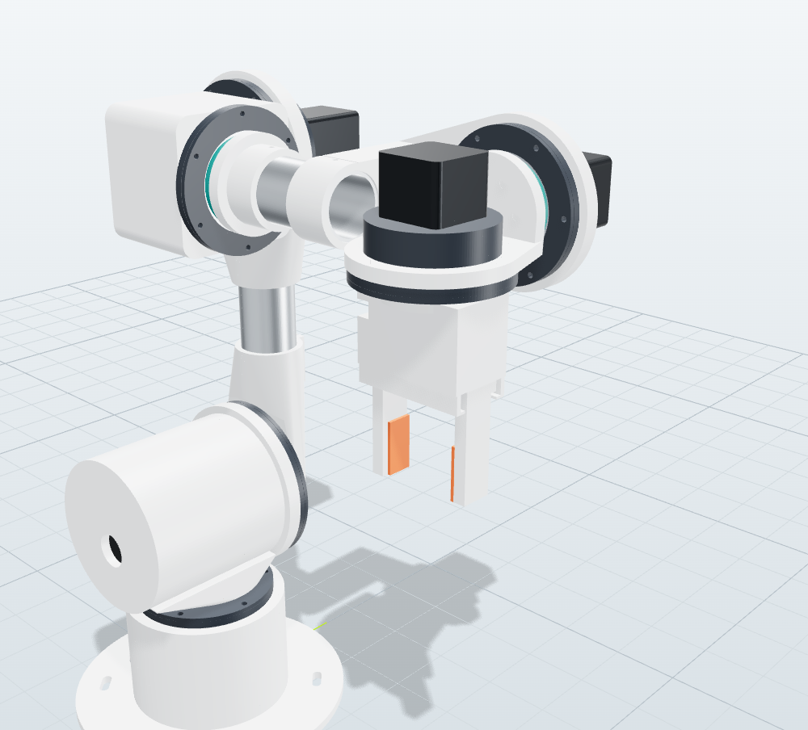

# 10. Assemblage



> Ce guide suit la CAO du dépôt. La géométrie a été contrôlée (0 interférence, débattements vérifiés), mais le montage
> n’a **pas encore été réalisé** sur un exemplaire physique. Signalez toute difficulté pour faire évoluer la CAO.
> Dans ORION Studio, l’onglet *Pièces 3D* met chaque pièce en évidence dans la vue 3D : gardez-le ouvert pendant le
> montage.

## Outillage

- Fer à souder avec panne pour inserts (ou panne conique), réglé à 230–245 °C pour le PETG.
- Clés Allen 2 / 2,5 / 3 / 4 mm, pied à coulisse, cutter d’ébavurage, lime douce.
- Étau (ou petite presse) pour emmancher goupilles et roulements, avec cales en bois.
- Scie à métaux + boîte à onglets, ou coupe-tube, pour les tubes aluminium. Lime et ébavureur.
- Frein filet faible (bleu), graisse PTFE (réducteurs), colle époxy bi-composant.

Serrages : les vis dans les inserts se serrent **à la main**, soit environ 0,6 N·m en M3 et 1,2 N·m en M4. Trop serrées,
elles arrachent l’insert du plastique.

## Étape 0 : préparation

1. Imprimez et validez `tolerance-test.stl` (voir [7. Impression 3D](07-impression-3d.md)).
2. Ébavurez toutes les pièces : pied d’éléphant, fils, bavures dans les alésages. Passez un foret à la main dans les
   trous de goupilles s’ils sont trop serrés.
3. **Posez tous les inserts filetés** avant tout assemblage : pointe du fer dans l’insert, pression douce et
   perpendiculaire. Arrêtez à fleur, puis appuyez une pièce plane dessus pendant le refroidissement.
4. Coupez les tubes Ø40 × 2 aux longueurs de la nomenclature : **117 mm** pour le bras, **79 mm** pour l’avant-bras.
   Coupes d’équerre, ébavurées.

## Étape 1 : les six modules réducteurs cycloïdaux

Six modules sont à monter : **CY-M** pour J1 et J3, **CY-L** pour J2, **CY-S** pour J4, J5 et J6. Ils sont tous
construits de la même façon :

```
   moteur ─┬─ carter (galets) ─ disque A ─ disque B ─ roulement principal ─ flasque (+ doigts, 688) ─ bague de sortie
           └─ came (2 roulements) sur l’arbre moteur
```

| Module | Galets (couronne) | Disques | Roulement principal | Came | Doigts de sortie |
|---|---|---|---|---|---|
| CY-S (20:1) | 21 × Ø4 × 20 | 20 lobes, e = 0,8 mm | 6810 | 2 × 6802 | 6 × Ø3 × 20 |
| CY-M (25:1) | 26 × Ø4 × 20 | 25 lobes, e = 0,9 mm | 6811 | 2 × 6803 | 6 × Ø4 × 24 |
| CY-L (30:1) | 31 × Ø5 × 24 | 30 lobes, e = 1,0 mm | 6814 | 2 × 6804 | 8 × Ø5 × 24 |

1. **Galets** : enfoncez les goupilles dans les trous du fond du carter, avec une cale et de légers coups ou à l’étau.
   Elles doivent être **parallèles** et tenir seules. Contrôlez-en une sur deux avec une équerre.
2. **Moteur** : fixez-le au dos du carter (NEMA17 : 4 × M3 × 8 ; NEMA23 : 4 × M5 × 16 + écrous). L’arbre traverse le
   fond.
3. **Came** : emmanchez les deux roulements de came sur les deux excentriques. Enfilez ensuite la came sur l’arbre
   moteur, **méplat contre méplat**, avec une goutte de frein filet, et poussez-la jusqu’en butée.
4. **Disque A** : enfilez-le sur le roulement de came inférieur en le tournant doucement pour engrener ses lobes entre
   les galets.
5. **Disque B**, repéré au marqueur : enfilez-le sur le roulement supérieur. Il est décalé d’un demi-lobe, donc il
   s’engrène naturellement quand la came est orientée à 180°. **Ne permutez jamais A et B.**
6. **Graissage** : une fine couche de graisse PTFE sur les galets et les trous de doigts. Pas de graisse épaisse, qui
   freine à basse température.
7. **Flasque de sortie** : emmanchez les doigts (goupilles de sortie) et le roulement 688 au centre, puis présentez le
   flasque. Les doigts entrent dans les trous des disques et le bout de la came dans le 688.
8. **Roulement principal** : emmanchez-le sur le flasque puis dans le logement avant du carter. Posez le **couvercle**
   (bague extérieure) puis la **bague de sortie** (bague intérieure), vissée dans les inserts du flasque.
9. **Essai à la main** : tournez l’arbre moteur (ou la sortie, beaucoup plus dur). La rotation doit être régulière, sans
   point dur sur un tour complet de sortie.
   - La sortie tourne **en sens inverse** du moteur : c’est normal pour une cycloïde, le logiciel le gère par le sens
     de l’axe.
   - Jeu à la sortie : il doit être à peine perceptible (≤ 0,3°). En cas de point dur, cherchez un pied d’éléphant sur
     un disque ou un galet mal enfoncé.

## Étape 2 : base et J1

1. **Plaque de base → socle** : 6 × M4 × 12 dans les inserts du socle. Orientez l’ouverture de passage des câbles
   de la plaque vers le boîtier électronique.
2. **Module J1 (CY-M)** : moteur vers le bas, à l’intérieur du socle. Fixez-le par le couvercle sur les inserts M4 de
   la face supérieure du socle (6 × M4 × 16).
3. Fixez le robot sur la table (4 × vis M6 dans les lumières). Un bras qui accélère exerce plusieurs N·m de
   basculement : **ne le faites jamais fonctionner posé libre**.

## Étape 3 : épaule (J2)

1. **Tourelle** : vissez-la sur la bague de sortie de J1 (6 × M3 × 16).
2. **Module J2 (CY-L)** : glissez le moteur NEMA23 dans l’alésage horizontal de la tourelle, puis fixez le module par
   son couvercle (6 × M4 × 16).

## Étape 4 : bras (J2 → J3)

1. **Raccord bas** (`upperarm-low`) sur la sortie de J2 (6 × M4 × 16).
2. **Tube de 117 mm** : engagez-le dans le raccord bas et le raccord haut (`upperarm-high`). Avant de serrer les vis
   M4 × 30 + écrous des colliers :
   - **alignez les axes** J2 et J3 (parallèles, contrôle à la règle sur les faces des modules) ;
   - réglez l’**entraxe J2–J3 à 240 mm** (paramètre DH a₂), au pied à coulisse d’axe à axe. La différence mesurée peut
     être saisie dans *Paramètres → Cinématique → a*.
3. **Module J3 (CY-M, NEMA17 60 mm)** dans le raccord haut, moteur côté extérieur (6 × M4 × 16).

## Étape 5 : coude et avant-bras (J3 → J4 → poignet)

1. **Bloc coude** (`elbow`) sur la sortie de J3. Il loge le module **J4 (CY-S)**, moteur vers l’arrière.
2. **Adaptateur de tube** (`forearm-adapter`) sur la sortie de J4.
3. **Tube de 79 mm** : collez-le à l’époxy dans l’adaptateur et dans le logement du poignet. Percez Ø3,2 et goupillez
   chaque extrémité avec une vis M3 × 50 + écrou nylstop.
   - Avant la prise de la colle, contrôlez la **distance axe J3 ↔ axe J5 = 220 mm** (d₄) et l’alignement de J5
     perpendiculaire à J4.

## Étape 6 : poignet (J5, J6)

1. **Module J5 (CY-S)** dans le poignet, moteur dépassant côté +y.
2. **Chape** (`yoke`) sur la sortie de J5.
3. **Module J6 (CY-S, NEMA17 34 mm)** : son carter se fixe sur la chape. La bague de sortie de J6 est la **bride
   outil**.

## Étape 7 : pince

1. Mettez le servo **au milieu de sa course** (1 500 µs, par exemple avec `GRIP 50` une fois le firmware en place, ou un
   testeur de servo).
2. Glissez le servo MG996R par le dessous du corps de pince et fixez-le (4 × M2).
3. Placez les deux doigts dans leurs glissières, **ouverts de la même valeur**. Engagez le **pignon** (vissé sur le
   palonnier rond, 4 × M2) entre les deux crémaillères, puis vissez-le sur l’axe du servo.
4. Collez les patins TPU sur les doigts.
5. Vissez le corps de pince sur la bride J6 (6 × M3 × 12). Vérifiez que `GRIP 0` ferme sans forcer contre la butée
   (réglez sinon `SET grip_closed`) et que `GRIP 100` ouvre à 50 mm.

## Étape 8 : capteurs et câblage

1. **Aimants et capteurs Hall** : collez l’aimant sur la partie tournante et le capteur sur la partie fixe, pour que le
   capteur soit atteint environ 2° au-delà de la butée logicielle (J1 −172°, J2 −133°, J3 +62°, J4 −172°, J5 −117°,
   J6 −182°). L’angle exact se mesure ensuite par calibration ([12. Calibration](12-calibration.md)).
2. **Câbles** :
   - regroupez les câbles de chaque segment dans une gaine tressée ;
   - fixez-les avec des colliers aux raccords imprimés ;
   - laissez une **boucle de service** autour de chaque articulation, dimensionnée pour son débattement complet
     (J1, J4 et J6 tournent de près de 360°).
   - Tous les câbles redescendent par l’ouverture de la plaque de base vers le boîtier électronique.
3. **Test de débattement, moteurs non alimentés** : amenez chaque axe à la main d’une butée à l’autre (doucement, à
   travers la réduction). Aucun câble ne doit se tendre ni frotter.

## Étape 9 : contrôle final avant mise sous tension

- [ ] Toutes les vis serrées, les modules tournent librement à la main.
- [ ] Bras fixé à la table, zone dégagée dans un rayon de 80 cm.
- [ ] Arrêt d’urgence câblé **et testé** (coupe la puissance des moteurs).
- [ ] Capteurs testés un par un (voir [9. Électronique](09-electronique.md), mise sous tension).
- [ ] Paramètres envoyés (`Envoyer la config`), vitesse réduite à 10–25 %.

Suite : [12. Calibration et mise en service](12-calibration.md).
